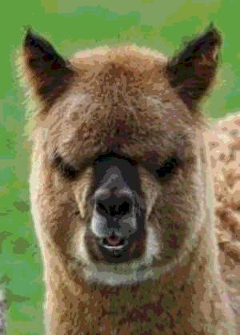
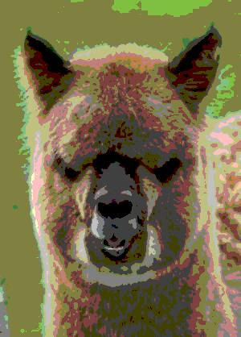
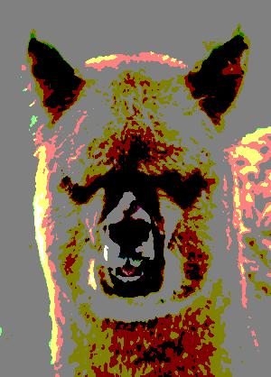
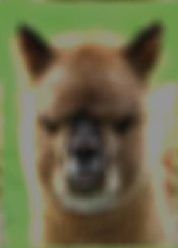
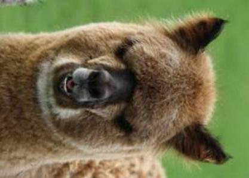
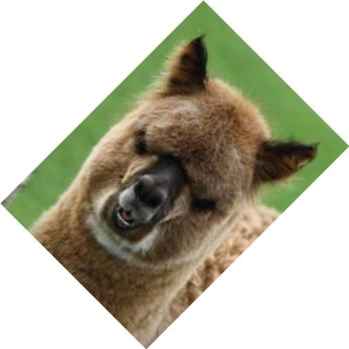
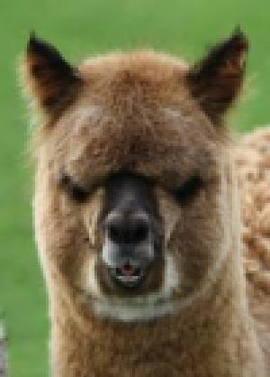
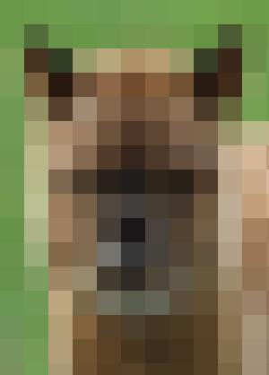

### original
```sh
gnome-open holy-animal.jpg
```


### reduce intensity

```sh
octave reduceIntensity.m holy-animal.jpg 16
octave reduceIntensity.m holy-animal.jpg 8
octave reduceIntensity.m holy-animal.jpg 4
octave reduceIntensity.m holy-animal.jpg 2
```





### blur
```sh
octave blur.m holy-animal.jpg 3
octave blur.m holy-animal.jpg 10
octave blur.m holy-animal.jpg 20
```




### rotate
```sh
octave rotate.m holy-animal.jpg 90
octave rotate.m holy-animal.jpg 45
```



### pixelize
```sh
octave pixelize.m holy-animal.jpg 3
octave pixelize.m holy-animal.jpg 9
octave pixelize.m holy-animal.jpg 27
```




