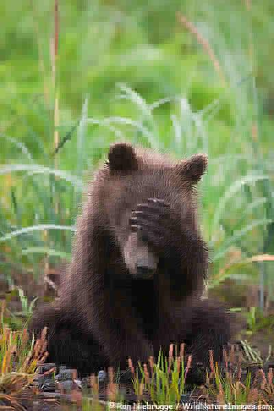
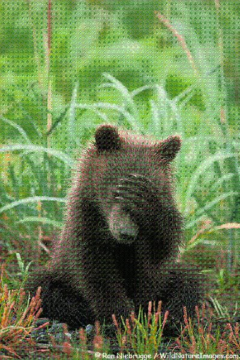
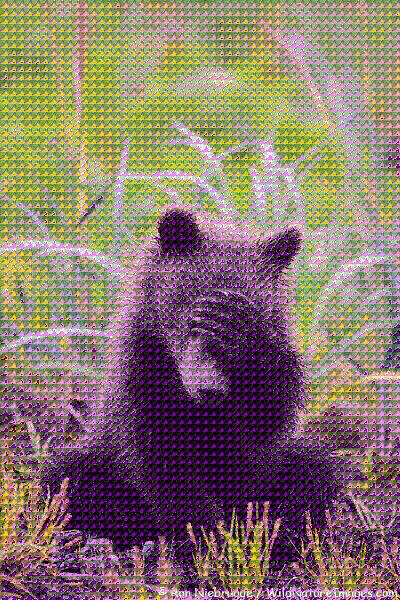
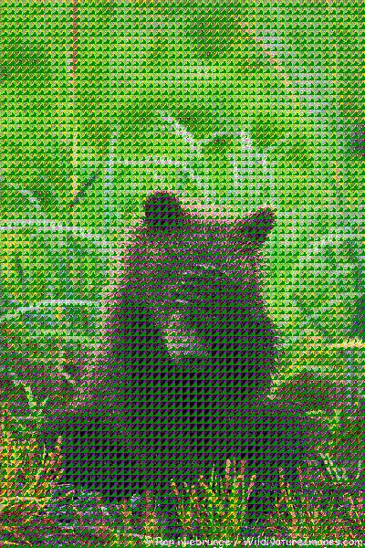

### basic JPEG implementation with DCT (Discrete Cosine Transform)
```sh
gnome-open grizzly.jpg
for i in 0.25 0.5 1 2 4 8
do
octave jpeg.m $i
done
```


### .. with FFT (Fast Fourier Transform)
multipliers are chosen so that the compressed files takes roughly the same bytes as the DCT multipliers in order
```sh
for i in 1 2 8 16 32 64
do
octave jpeg-fft.m $i
done
```





### .. without any transformation
```sh
for i in 1 2 4
do octave jpeg-just-quantization.m $i
done
```




### .. with DCT, constant quantization for Y-channel and more quantization for Cb and Cr
```sh
for i in 1 2 4 8 16 32 64 128
do octave jpeg-colored.m $i
done
```


### dependencies
* octave-signal
  * dct
  * idct
* octave-image
  * ~~rgb2ycbcr~~
```sh
apt-get install octave-signal
apt-get install octave-image
```
