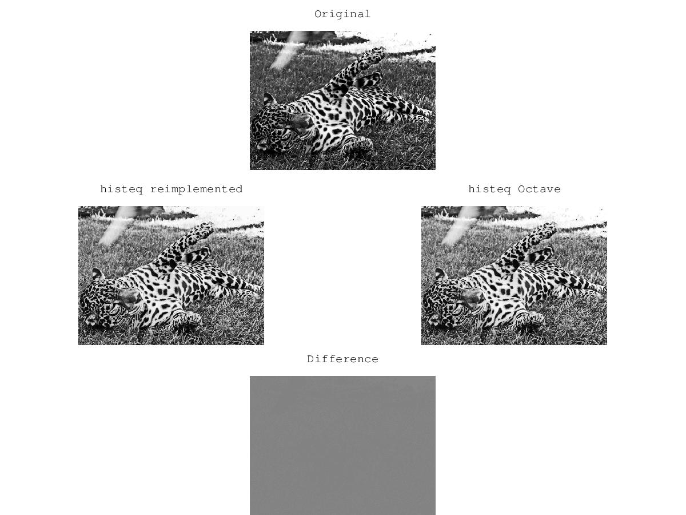
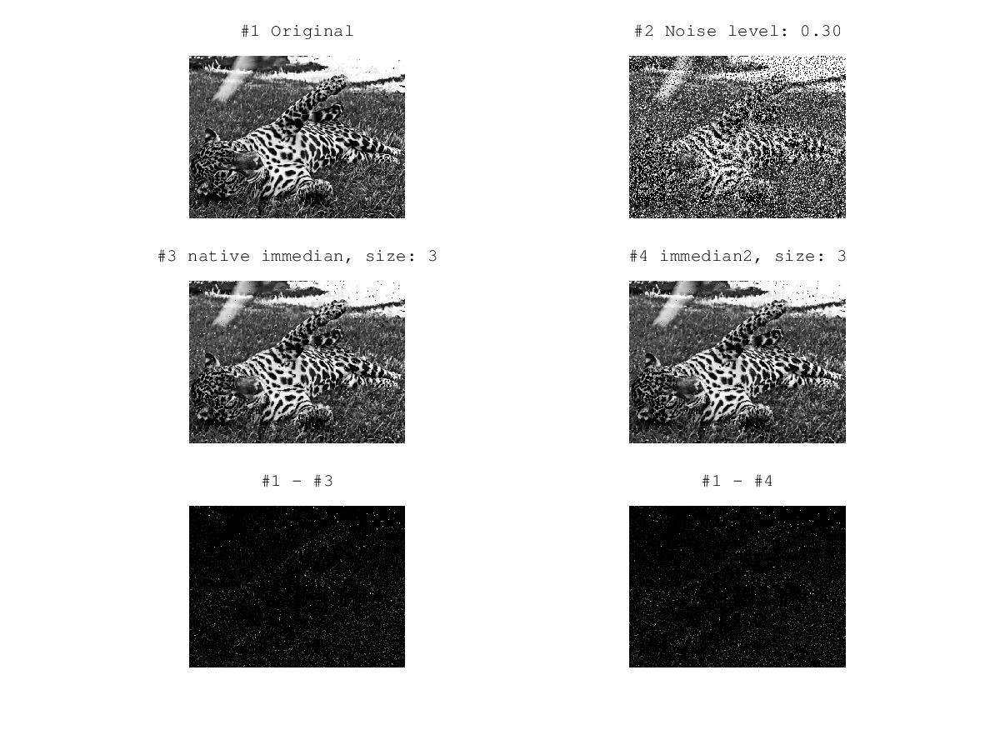
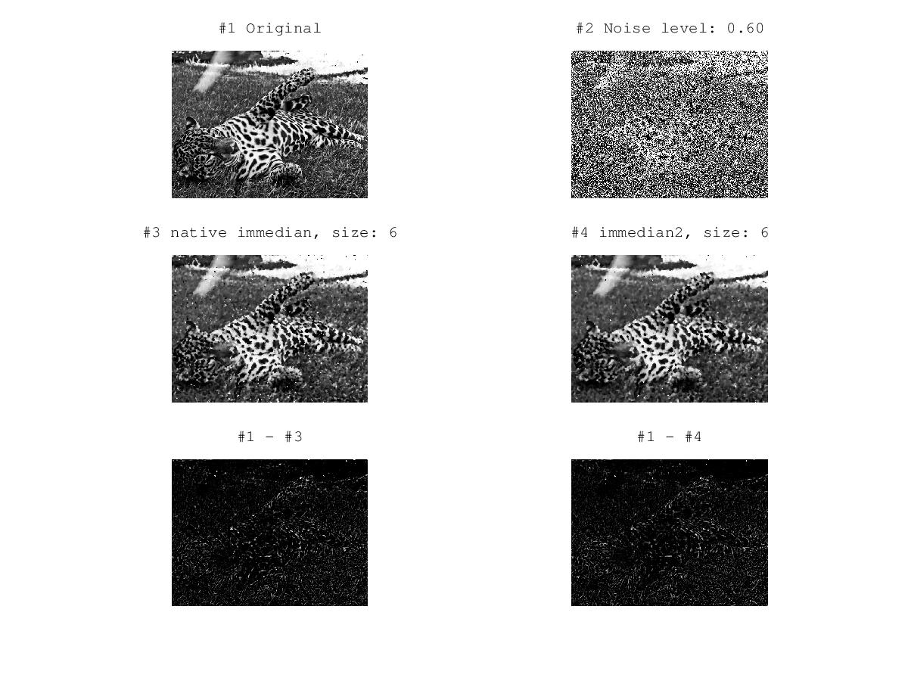
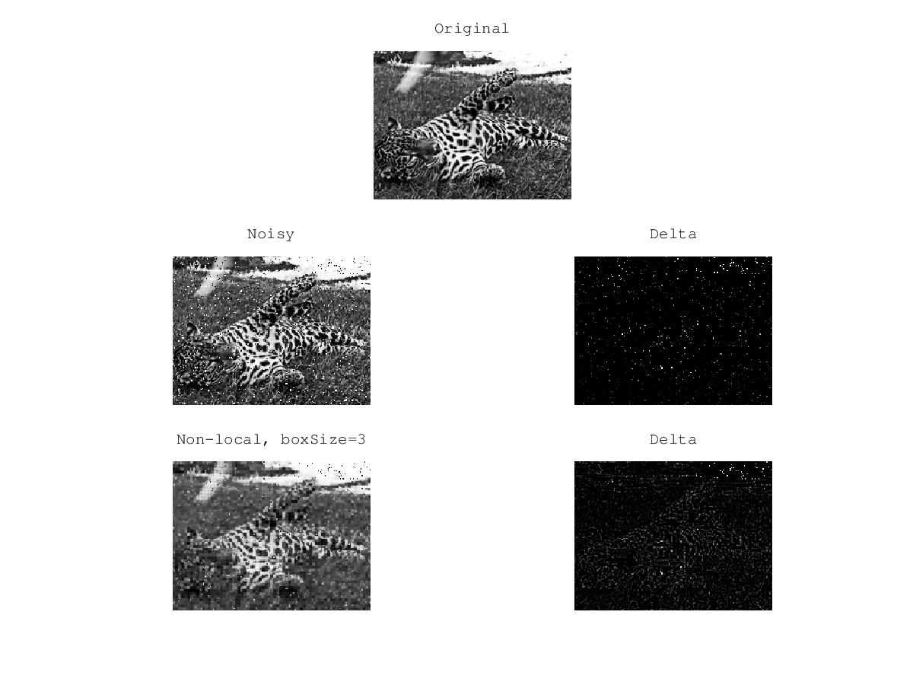

### histogram equalization
```sh
octave histeq_demo
```


### median filter
```sh
octave immedian_demo 30 3
```


```sh
octave immedian_demo 60 6
```


### nonlocal means
```
octave nonlocal_demo 3
```

